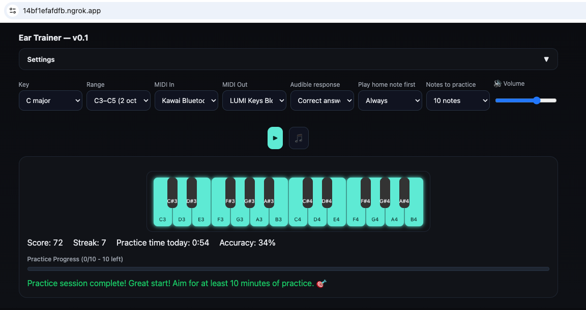

# Web-based Ear Trainer (with MIDI support)

Single-page ear trainer that plays a target note and checks your answer from a MIDI keyboard (or on-screen). Minimal, modular, ROLI-friendly.



## Quick start
[Try it live](https://erikdebruijn.github.io/ear-trainer/)

## Stack
- Audio: [Tone.js] for prompts and feedback
- MIDI I/O: [WebMidi.js] (MIDI in/out, MPE-safe by listening on all channels)
- UI piano: Custom HTML-based keyboard with proper key highlighting
- ROLI LUMI support: Full SysEx protocol for LED lighting

[Tone.js]: https://tonejs.github.io/
[WebMidi.js]: https://webmidijs.org/docs/getting-started/basics

## Features (v0.1)

### Core Gameplay
- **Flexible practice sessions**: No time limits, configurable target (10-100 notes)
- **Key & range selection**: Major/natural minor scales with visual highlighting  
- **Dual input methods**: MIDI keyboard + responsive on-screen keyboard
- **Audio feedback**: Tonic-target patterns with configurable home note frequency
- **Progress tracking**: Real-time progress bar with remaining notes display

### User Experience
- **Quick start**: Press any key to begin (auto-selects key based on root note)
- **Smart settings**: Collapsible settings panel with localStorage persistence
- **Visual feedback**: Screen flashes, key highlighting, and status indicators
- **Fast response detection**: Special "FAST!" feedback for quick answers (<1.5s)
- **Celebration effects**: Confetti animation on session completion
- **Volume control**: Master volume slider with speaker icon

### Practice Features
- **Daily practice tracking**: Persistent session time across page refreshes
- **Audible responses**: Configurable audio feedback (correct only/always)
- **Scale visualization**: Active scale notes highlighted on keyboard
- **Response time tracking**: Performance analytics with speed feedback
- **Achievement encouragement**: 10-minute practice milestone recognition

### MIDI Integration
- **Universal MIDI input**: Works with any MIDI controller
- **ROLI LUMI lighting**: Full LED keyboard integration with SysEx protocol
- **Smart MIDI output**: Restricted to ROLI devices for safety
- **Note-on/off handling**: Proper sustained note management

### Technical
- **No build step**: Direct ES6 module serving
- **Persistent storage**: Settings and daily practice time in localStorage
- **Responsive design**: Works on desktop and mobile devices
- **Dark theme**: Professional UI with accent colors for feedback

## Development Commands

```bash
# Local development server
npm run serve           # http-server on port 8080
npm run dev            # alias for serve

# HTTPS tunnel for MIDI permissions (requires ngrok)
npm run https          # opens ngrok tunnel to localhost:8080

# Code formatting
npm run format         # prettier -w .
```